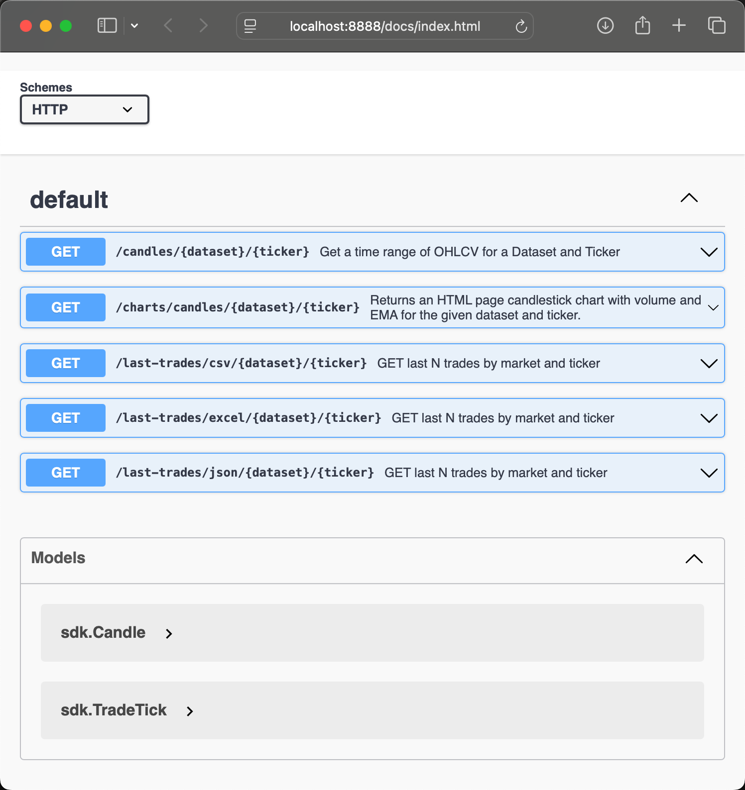
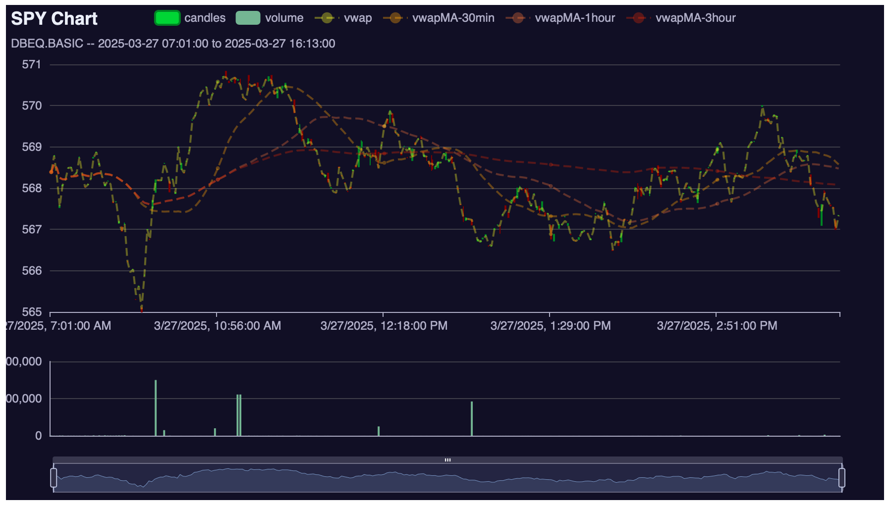

# dbn-duckduck-goose

**Golang Web Service Example using Databento and DuckDB**

*https://github.com/NimbleMarkets/dbn-duckduck-goose*

This `dbn-duckduck-goose` repository contains an example Golang webservice that uses [Databento's](https://databento.com) data-as-a-service backend and embedded [DuckDB](https://duckdb.org) for storage and query.  

<p><a href="./etc/swagger_console.png"></a>&nbsp;<a href="./etc/dbeqbasic.SPY.html"></a></p>

Open source technologies used include:
 * [Golang](https://golang.org) for the programming language
 * [Databento](https://databento.com) for data-as-a-service
 * [DuckDB](https://duckdb.org) for embedded SQL database
 * [OpenAPI](https://swagger.io/specification/) for API interop
 * [Swaggo's `swag`](https://github.com/swaggo/swag) for code-driven OpenAPI generation
 * [Gin](https://gin-gonic.com/docs/) for the web service framework
 * [`dbn-go`](https://github.com/NimbleMarkets/dbn-go) for DataBento Golang support
 * [Apache ECharts](https://echarts.apache.org/en/index.html) for JavaScript charting
 * [`go-echarts`](https://go-echarts.github.io/go-echarts/#/) for Golang bindings to ECharts
 * [Taskfile](https://taskfile.dev) task runner

*CAUTION: This program incurs DataBento billing!*


## Example

Build and run the `dbn-duckduck-goose` server:
```bash
$ git clone https://github.com/NimbleMarkets/dbn-duckduck-go.git
$ cd dbn-duckduck-go
$ task build

# run server
$ export DATABENTO_API_KEY="<your_api_key>"
$ ./bin/dbn-duckduck-goose --dataset DBEQ.BASIC --out qqq.dbn.zst QQQ
```

Then test in another terminal or a web browser:

```bash
# read the specification
$ curl -v http://localhost:8888/docs/doc.json | less

# or open the Web GUI in a web browser
$ open http://localhost:8888/docs/index.html

# query for latest trades as JSON
$ curl http://localhost:8888/api/v1/last-trades/json/DBEQ.BASIC/QQQ

# query for latest trades as CSV
$ curl http://localhost:8888/api/v1/last-trades/csv/DBEQ.BASIC/QQQ

# query for latest trades as Excel
$ curl http://localhost:8888/api/v1/last-trades/excel/DBEQ.BASIC/QQQ

# query for candlesticks as JSON
$ curl http://localhost:8888/api/v1/candles/DBEQ.BASIC/QQQ

# interact with a chart in a web browser
$ open http://localhost:8888/api/v1/charts/candles/DBEQ.BASIC/SPY
```

Since those charts are self-contained, we've bundled an [SPY chart example here](./etc/dbeqbasic.SPY.html) for you to try out. 


## Usage

The following environment variables control some behavior:

| Variable | Default | Description |
|--| -- | -- |
| `DATABENTO_API_KEY` | "" | DataBento API key to use for authorization |
| `GIN_MODE` | "debug" | Affects logging and [Gin](https://gin-gonic.com/docs/deployment/). May be `debug`, `release`, or `test` |

```
usage: ./bin/dbn-duckduck-goose -d <dataset> [opts] symbol1 symbol2 ...

  -d, --dataset string    Dataset to subscribe to
      --db string         DuckDB datate file to use (default: ':memory:')
  -h, --help              Show help
  -p, --hostport string   'host:port' to service HTTP (default "localhost:8888")
  -k, --key string        Databento API key (or set 'DATABENTO_API_KEY' envvar)
  -o, --out string        Output filename for DBN stream ('-' for stdout)
  -n, --snapshot          Enable snapshot on subscription request
  -t, --start string      Start time to request as ISO 8601 format (default: now)
  -v, --verbose           Verbose logging```


## Building the project

Building depends on Taskfile [Taskfile](https://taskfile.dev)) and [Swag](https://github.com/swaggo/swag) for OpenAPI generation. Install the latter with `go install github.com/swaggo/swag/cmd/swag@latest` or `task dev-deps`.  Run `task build` to build the binary.

```sh
# Quickstart for OSX users
$ brew install go-task/tap/go-task
$ task dev-deps
$ task build
```

## License

**NOTE:** This library is **not** affiliated with Databento.  It is for educational use.  Please be careful as this service incurs billing.  We are not responsible for any charges you incur.

Adapted from [sample code](https://github.com/NimbleMarkets/dbn-go/blob/main/cmd/dbn-go-live/main.go) in  [NimbleMarkets `dbn-go` library](https://github.com/NimbleMarkets/dbn-go) and other Neomantra/NimbleMarkets code.

Released under the [MIT License](https://en.wikipedia.org/wiki/MIT_License), see [LICENSE.txt](./LICENSE.txt).

Copyright (c) 2025 [Neomantra Corp](https://www.neomantra.com).   

----
Made with :heart: and :fire: by the team behind [Nimble.Markets](https://nimble.markets).
